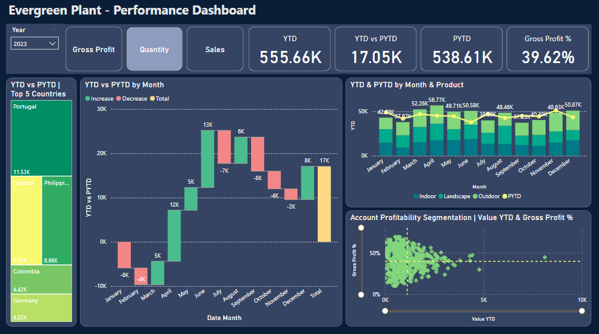
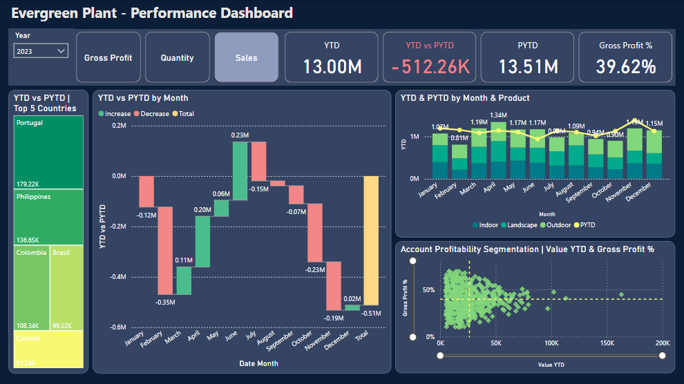

# Plant Co. - Data Analysis

## Executive Summary
Plant Co. was established in 2022 that sells indoor, landscape, and outdoor products. The analysis offers an overview of Plant Co.'s performance from 2022 to 2024 across three key metrics: Gross Profit, Quantity Sold, and Sales Revenue. With visualizations supporting the findings, it becomes clear how Plant Co. has experienced fluctuations over the years, revealing insights into overall financial health and operational efficiency. 2024 business year remains in progress.

## Data Overview
The data set encompasses three years of operational metrics:
- **2022:** Baseline year with initial performance data
- **2023:** Year of adjustment with notable shifts in profitability and sales
- **2024:** Current performance indicators showcasing ongoing trends and areas needing attention

## Data Structure & Initial Checks

Plant Co.'s database structure consists of four tables: **Sales**, **Products**, **Account** & **Date** Prior to beginning the analysis, a variety of checks were conducted for quality control. The data was cleaned, organised, and prepared including familiarization with the datasets.

The raw dataset in Excel can be downloaded [here](datasets/Plant_Co_Dataset.xlsx)

## Gross Profit Analysis

### Yearly Trends

- **2022:** Gross Profit stood at **$5.42M** with a profit percentage of **40.09%**. The top three countries contributing to profit were **China**, **Brazil** and **Philippines**. Contribution from product category were: **Outdoor ($1.85M)**, **Indoor ($1.82M)** and **Landscape ($1.75M)**.
- **2023:** A decline was noted with Gross Profit falling to **$5.15M** and a profit margin drop to **39.62%**. The top three countries contributing to profit were **Portugal**, **Philippines** and **Canada**. Contribution from product category were: **Outdoor ($1.93M)**, **Indoor ($1.58M)** and **Landscape ($1.63M)**.
- **2024 (up to April):** Gross Profit remains at **$1.40M, 39.15%**, **Outdoor ($0.54M)** being the highest selling category, with **Sweden ($37.85K)** contributing to profit the most.
  
Consistent monthly profit margins observed throughout 2022 as per screenshot below. 

## Quantity Sold Analysis

### Yearly Trends

- **2022:** Quantity sold was **538.61K**. The top three countries were **China**, **Philippines** and **Brazil**. Quantity sold by product category were: **Outdoor (182K)**, **Indoor (180K)** and **Landscape (177K)**
- **2023:** Sold quantity increased to **555.66K**. The quantity sales figures by product category were: **Outdoor (207K)**, **Indoor (175K)** and **Landscape (174K)**. The top three countries were **Portugal**, **Canada**, and the **Philippines** as per screenshot below.
- **2024 (up to April):** Quantity sold remains at **148.47K** till date. Selling most quantity to **Poland (4.07K)** with product category **Landscape (54K)** is in the lead.
  
 Noticeable variations in certain months may suggest seasonal influences including changes in demand or disruptions in the supply chain.

## Sales Revenue Analysis

### Yearly Trends

- **2022:** Sales reached **13.51M**. The top three countries contributing to sales were **China**, **Brazil** and the **Philippines**. Sales figures by product category were: **Outdoor ($4.7M)**, Indoor **($4.5M)** and Landscape **($4.3M)**.
- **2023:** A noticeable decrease in sales to **13.00M** was recorded. Sales exhibited strong performance from March to June, whereas other months experienced a notable decline. Sales figures by product category were: **Outdoor ($4.8M)**, Indoor **($4M)** and Landscape **($4.2M)**. The top three countries contributing to sales were **Portugal**, **Philippines** and **Colombia**.
- **2024 (up to April):** Revenue for the business year remains at **3.57M**.

Variations in revenue correlate with changes in pricing strategy or market conditions.

## Product Segmentation

- Analysis shows that sales are reliant on Indoor, Outdoor and Landscape products.
- Indoor products consistently show higher sales volume compared to Outdoor and Landscape products.
- Gross profit is largely driven by the same product segmentation patterns observed in sales.

## Comparative Insights

- **Year-Over-Year Changes:** Compared to 2022, both gross profit and sales revenue show a decline in 2023 and 2024.
- **Performance Consistency:** The overall decline in profit margin suggests potential structural inefficiencies or increased costs.
  
### 7. Recommendations

- **Market Analysis & Research:** Conduct a thorough market analysis to identify potential drivers behind declines in sales and profit. And  conduct market research to identify shifts in customer preferences.
- **Marketing Initiatives:** Increase marketing efforts, especially focusing on underperforming regions and products.
- **Sales Strategy Re-evaluation:** Reassess sales strategies to capture competitive market segments effectively.
- **Product Strategy:** Reassess product offerings, focusing more on profitable segments.
- **Cost Management:** Prioritize cost-reduction strategies while maintaining product quality to enhance profit margins.

## Assumptions and Caveats

Throughout the analysis, multiple assumptions were made to manage challenges with the data. These assumptions and caveats are noted below:
- The collected data is complete and correct.
- According to the dataset, sales data for 2024 is available uo to April. Therefore, it has been assumed that the business year remains in progress.
- Approximately 2% had some null values. To ensure clarity, the data has been filtered appropriately in the report.

## References 

Here are the references that contributed to the completion of this project.

- [DataCamp](https://www.datacamp.com/) DataCamp offers interactive R, Python, Sheets, SQL and shell courses. All on topics in data science, statistics and machine learning.
  
- [Mo Chen](https://www.youtube.com/@mo-chen) A Data Analytics Manager and Content Creator who produces insightful and educational videos to help stay ahead and remain competitive in the ever-evolving data industry.

